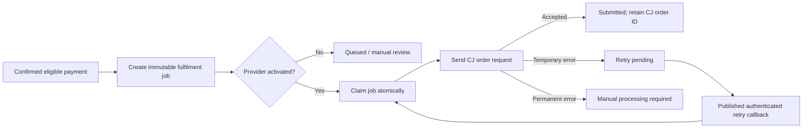

# CJ Dropshipping Fulfilment Architecture

## Purpose and ownership boundary

Alpha Collective will support **admin-managed, white-labeled catalogue products** alongside independent vendor listings. An official product presents only `Alpha Collective Official` to buyers. Its external SKU, supplier cost, CJ variant ID, provider configuration, API credentials, payload snapshots, and provider responses remain server-side and administrator-only.

| Concern | Design decision |
| --- | --- |
| Public product identity | Buyer API returns standard catalog fields and `Alpha Collective Official`; it never returns supplier, cost, external SKU, provider name, or job state. |
| Admin sourcing | An admin-only product workspace records the External SKU ID, supplier cost with currency, and one fulfilment selection: Local Vendor, Auto-Fulfill API, or Manual Admin. |
| Payment trigger | A durable job is created only after an eligible payment is confirmed. For the current system, this means a wallet order entering held escrow. COD never triggers a supplier order, and future Paystack/Flutterwave product checkout must create the same job only after verified payment confirmation. |
| Customer safety | Supplier failures cannot cancel or fail the customer order. The job changes to a manual-processing state and administrators see a red failure badge with a sanitized error summary. |
| Retry safety | Jobs carry an immutable Alpha order reference plus idempotency key. At most one active dispatch is claimed transactionally, and CJ receives the Alpha reference as `orderNumber`. |

## CJ activation contract

CJ order creation requires an authenticated server request to its official `createOrderV2` or `createOrderV3` endpoint with a `CJ-Access-Token`, a unique partner `orderNumber`, destination fields, a logistics choice, and product variant (`vid` or `sku`) plus quantity. CJ documents `payType=3` as creation-only, while `payType=2` uses a CJ balance payment; Alpha Collective will not enable either mode until an administrator explicitly enables the provider and confirms the CJ payment approach. [1]

The CJ API key is exchanged server-side for an access token; CJ explicitly requires access tokens to remain on the backend. The application therefore uses server-only secret configuration, not a database column or browser form, for the CJ API key. [2]

## Durable queue lifecycle

Jobs are persisted before any request. The immediate checkout path may enqueue and perform one bounded dispatch attempt, but it never delays or rolls back a successful customer payment because of a supplier response. A published authenticated retry callback later handles recoverable jobs. It must be idempotent and can only be enabled after the site is deployed.

## CJ callbacks

Once a published HTTPS domain is available, Alpha Collective can receive CJ order and logistics updates. CJ requires verification of the raw JSON request body using Base64 HMAC-SHA256, with the saved CJ `openId` as the secret and the `sign` header as the signature. Callback processing must return promptly and deduplicate message IDs. [3]

> **Activation rule:** No CJ request, balance charge, supplier order, or inbound callback acceptance occurs until the CJ API key is validated, the provider is enabled by an administrator, the published callback URL is registered, and a controlled sandbox order is approved.

## References

[1] [CJ Docs — Create Order V2/V3](https://developers.cjdropshipping.cn/en/api/api2/api/shopping.html)

[2] [CJ Docs — Authentication and server-side token storage](https://developers.cjdropshipping.cn/en/api/api2/api/auth.html)

[3] [CJ Docs — Webhook Mechanism](https://developers.cjdropshipping.cn/en/api/start/webhook.html)
